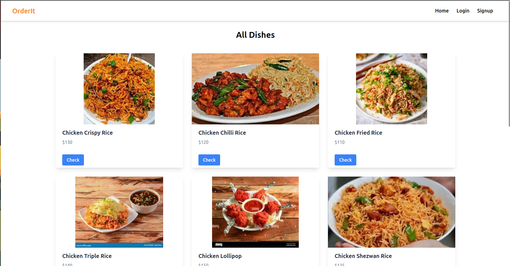
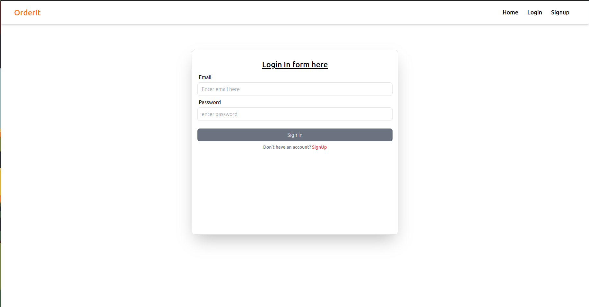
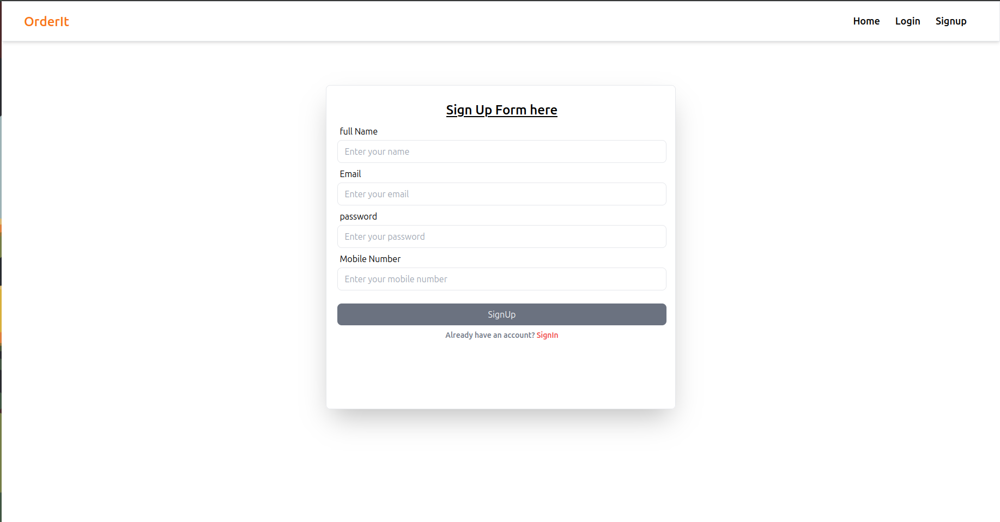
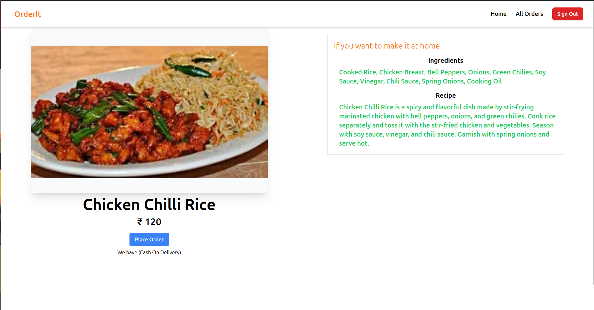
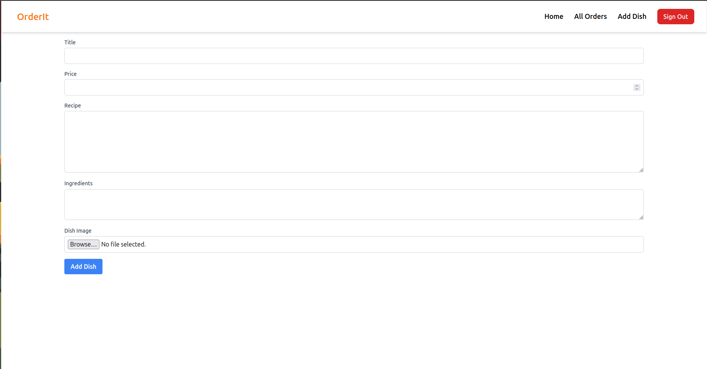
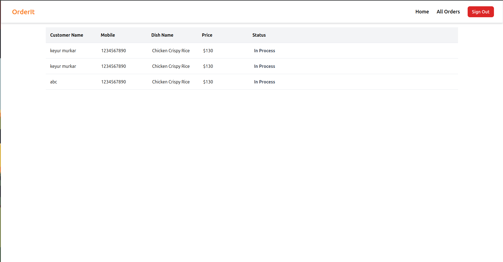
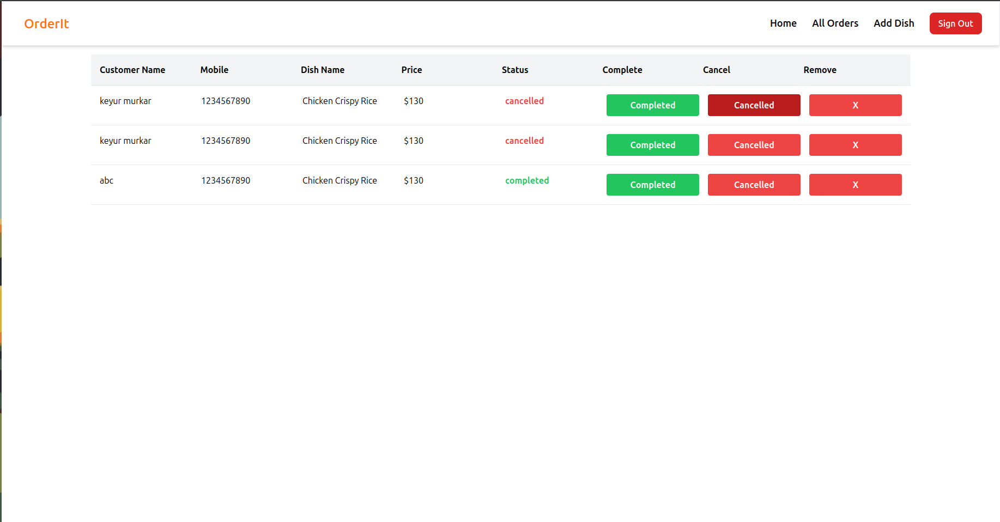

# Project - OrderIt Frontend

## Table of Contents
- [Introduction](#introduction)
- [Features](#features)
- [Screenshots](#screenshots)
- [Installation](#installation)


## Introduction
OrderIt FullStack is a MERN-based web application for managing and displaying various dishes. Where users can place orders for their dishes. And check if their dish is completed or not. This repository contains the frontend code for the OrderIt project.

## Features
- User authentication and registration
- Normal user can place order for certain dish 
- Admin can add new dishes
- Admin can change the dish status. for normal users to check if there dish is ready or not
- Display dishes with detailed information
- Responsive design for mobile and desktop views

- ## Screenshots

*Dashboard*


*Login Page*


*Sign Up Page*


*Dish Details*


*Add Dish Form* Only Visible to Admin


*All Orders Page* Normal user view


*All Orders Page* Admin view


## Installation
1. Clone the repository:
   ```bash
   git clone https://github.com/your-username/frontend-repo.git
   cd frontend-repo
   
2. Clone another repository (for backend):
   Refer my OrderIt-Back repository. for backend configuration.  
